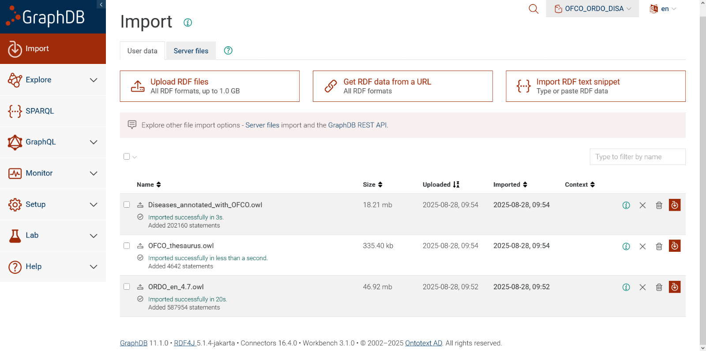
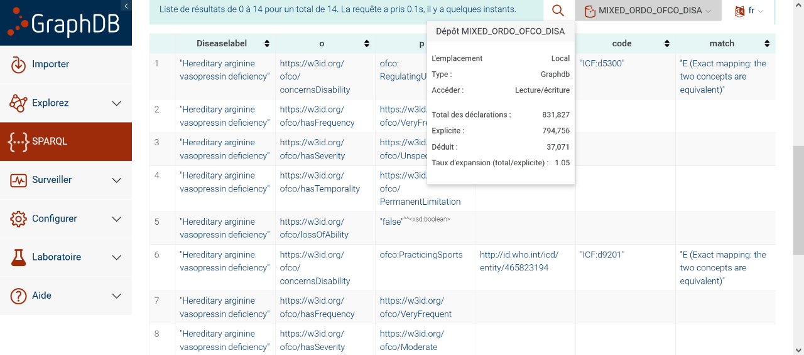

# GRAPHDB loading OFCO, ORDO, Diseases_annotated_with_OFCO.owl
##### Tested with: GraphDB 10.x, ORDO 4.7, OFCO 0.1 and Diseases_annotated_with_OFCO.owl
##### Author: [Marc Hanauer]
##### Date: 2025-08-27

### GRAPHDB : create a repository, upload ORDO, OFCO and the annotated diseases. (NB: advanced option "Blank nodes" if you have issues)
Go to "Setup" section in GraphDB. Create a "New Repository", "GraphDB Repository"
 
Once your repository is created and made "active, go to the "Import" section

Choose "Upload RDF files", import ORDO [`ORDO_en_4.7.owl`](https://sciences.orphadata.com/ordo/)), OFCO ([`OFCO_thesaurus.owl`](../OFCO_Thesaurus.owl)) and ([`Diseases_annotated_with_OFCO.owl`](../data/output/Diseases_annotated_with_OFCO.owl))
You should obtain this :



### SPARQL
Be sure your graphdb repository is loaded and active.
Go to SPARQL section in GraphDB GUI

Copy & paste the sparl query bellow :

```text
PREFIX : <https://w3id.org/ofco#>
PREFIX obo: <http://purl.obolibrary.org/obo/>
PREFIX rdf: <http://www.w3.org/1999/02/22-rdf-syntax-ns#>
PREFIX rdfs: <http://www.w3.org/2000/01/rdf-schema#>
PREFIX owl: <http://www.w3.org/2002/07/owl#>
PREFIX ORDO: <http://www.orpha.net/ORDO/>
PREFIX ordo: <http://www.orpha.net/ORDO/>
PREFIX ofco: <https://w3id.org/ofco#>

SELECT ?Diseaselabel ?o ?p ?uri ?code ?match
WHERE {
    # Target disease - replace with the disease URI of interest (using ORDO IRI)
    ordo:Orphanet_30925 <https://w3id.org/ofco/hasDisabilityAnnotation> ?annotation .
    ordo:Orphanet_30925 rdfs:label ?Diseaselabel.
    
    # Annotation properties
    ?annotation ?o ?p.
    
    # Optional ICF URI (may exist or not)
    OPTIONAL {?p ofco:hasICFuri ?uri}.
    
    # Annotation metadata with ICF code and manual assertion of mappings (ICF codes may exist or not)
    OPTIONAL {
        ?axiom a owl:Axiom ;
               owl:annotatedProperty ofco:hasICFuri ;
               owl:annotatedSource ?p ;
               ofco:hasICFcode ?code ;
               obo:ECO_0000218 ?match .
    }
}
LIMIT 200

```

### Query Execution
You should obtain this query 

*Example query being executed in GraphDB Workbench*

#### Expected results:
#### - Diseaselabel: Disease name
#### - o, p: Annotation properties and objects
#### - uri: Associated ICF URI
#### - code: ICF code
#### - match: Manual assertion for the mapping (E), (NTBT), (BTNT)

### GRAPHDB Results

*Disability annotations for Orphanet_30925*


