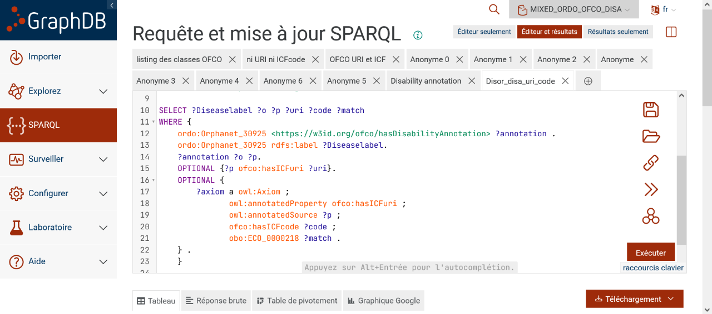

# SPARQL & GRAPHDB
# Query: Disability annotations for a specific disease
# Description: Retrieves OFCO annotations for a given ORDO disease with ICF codes and URI
# Use case: Analysis of disability profile for a rare disease
# Tested with: GraphDB 10.x, ORDO 4.7, OFCO 0.1 and Diseases_annotated_with_OFCO.owl
# Author: [Marc Hanauer]
# Date: 2025-08-27

## GRAPHDB : create a repository, upload ORDO, OFCO and the annotated diseases. (NB: advanced option "Blank nodes" if you have issues)

# Standard prefixes for ORDO/OFCO
PREFIX : <https://w3id.org/ofco#>
PREFIX obo: <http://purl.obolibrary.org/obo/>
PREFIX rdf: <http://www.w3.org/1999/02/22-rdf-syntax-ns#>
PREFIX rdfs: <http://www.w3.org/2000/01/rdf-schema#>
PREFIX owl: <http://www.w3.org/2002/07/owl#>
PREFIX ORDO: <http://www.orpha.net/ORDO/>
PREFIX ordo: <http://www.orpha.net/ORDO/>
PREFIX ofco: <https://w3id.org/ofco#>

SELECT ?Diseaselabel ?o ?p ?uri ?code ?match
WHERE {
    # Target disease - replace with the disease URI of interest (using ORDO IRI)
    ordo:Orphanet_30925 <https://w3id.org/ofco/hasDisabilityAnnotation> ?annotation .
    ordo:Orphanet_30925 rdfs:label ?Diseaselabel.
    
    # Annotation properties
    ?annotation ?o ?p.
    
    # Optional ICF URI (may exist or not)
    OPTIONAL {?p ofco:hasICFuri ?uri}.
    
    # Annotation metadata with ICF code and match score (ICF codes may exist or not)
    OPTIONAL {
        ?axiom a owl:Axiom ;
               owl:annotatedProperty ofco:hasICFuri ;
               owl:annotatedSource ?p ;
               ofco:hasICFcode ?code ;
               obo:ECO_0000218 ?match .
    }
}
LIMIT 200

# Expected results:
# - Diseaselabel: Disease name
# - o, p: Annotation properties and objects
# - uri: Associated ICF URI
# - code: ICF code
# - match: Match score

## 🖼️ Visual Examples

### Query Execution

*Example query being executed in GraphDB Workbench*

### Sample Results

*Disability annotations for Orphanet_30925*